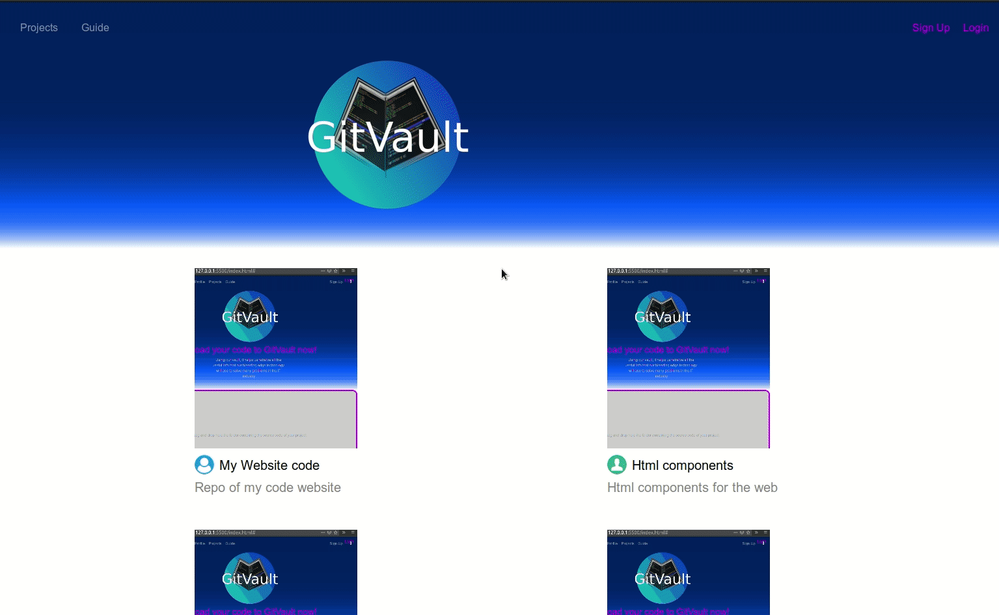
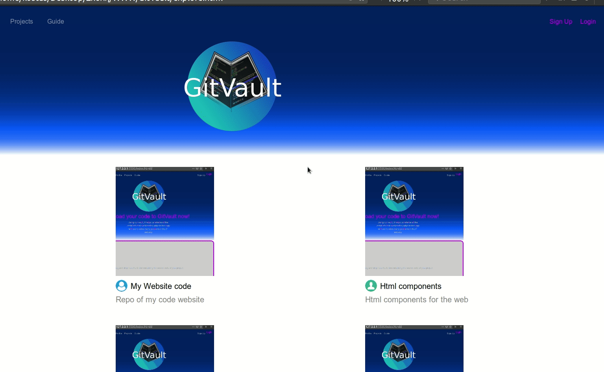
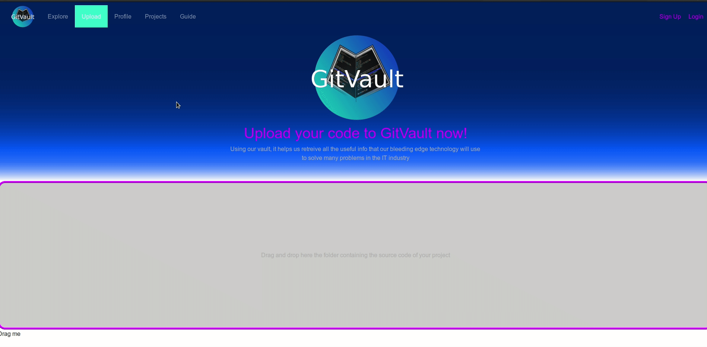
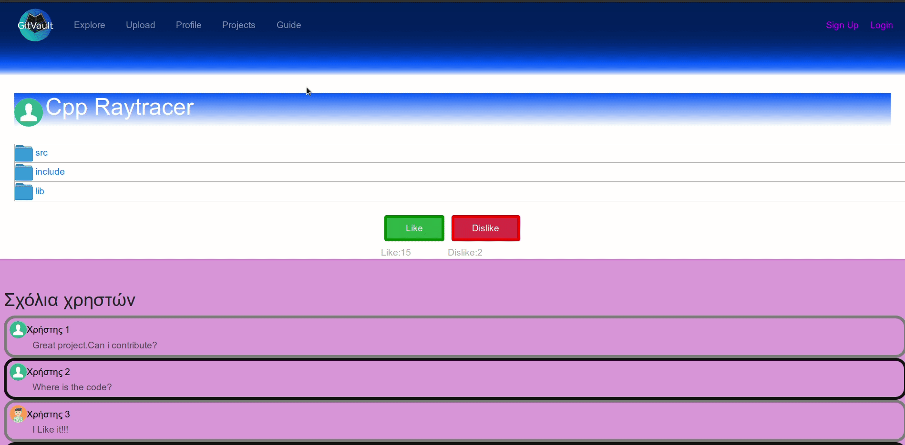
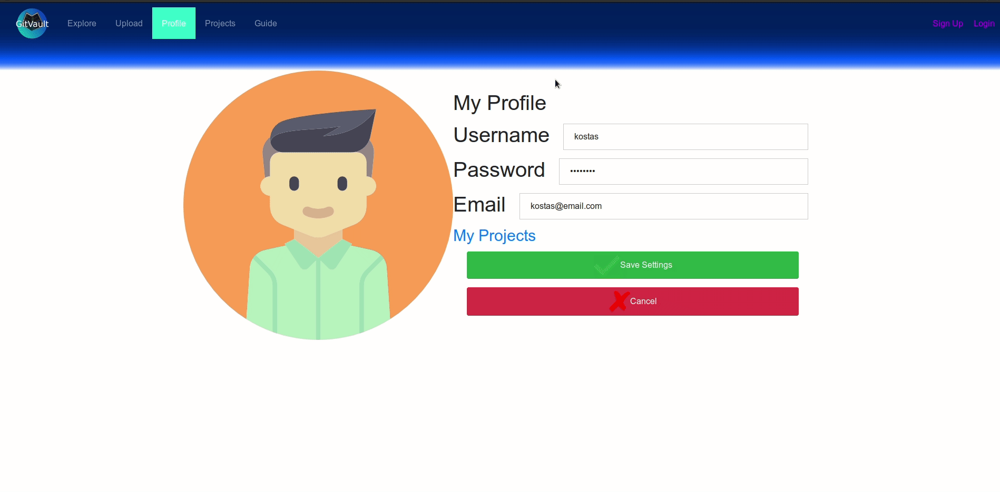

# 🚀 GitVault-NodeJS

A **third-year Computer Science web-project** built to explore the internals of Git over HTTP using Node.js.  
This project demonstrates how to integrate Git’s `git-http-backend` into a modern web application environment while handling low-level CGI integration, request parsing, and repository serving.

---

## ✨ Highlights
- ⚡ **Node.js + Express** backend handling Git HTTP requests  
- 🔒 Implements Git’s low-level `git-http-backend` with custom environment setup  
- 📂 Repository management directly from a browser or HTTP client  
- 🎓 Built as an **academic study project**, but extensible for real-world scenarios  
- 🛠️ Clean code, modular design, and practical debugging

---

## 📸 Demo Preview
Below are live previews (GIFs) of GitVault-NodeJS in action. All assets are located in `public/gifs/`.

# Register
<p align="center">
  
</p>

# Login
<p align="center">
  
</p>

# Explore other projects
<p align="center">
  
</p>

# View your projects
<p align="center">
  
</p>

# Upload a zip project by click
<p align="center">
  
</p>

# Upload a zip project by drag n drop
<p align="center">
  
</p>

# View project files
<p align="center">
  
</p>

# Edit your profile
<p align="center">
  
</p>

---

## 📦 Installation

```bash
# clone the repository
git clone https://github.com/kostaspetsis/GitVault-nodejs.git
cd GitVault-nodejs-master

# install dependencies
npm install

# run the server
npm start


## ⚡ Running
Gitvault works with a terminal like github and other hosts with push and pull commands, handled by git-http-backend
When uploading your project, make it a zip project, gitvault will decompress it and make the folder structure correctly with .init file.
  - You can upload it by click or drag and dropping

## 📦 Project features
- git-http-backend for git commands
- Login/Register by firebase
- Internal decompression of zipped projects when uploading your project
- Pug for rendering
- Multer for uploading files
- Dropzone for Drag n Drop
- Commenting and liking or disliking user projects

